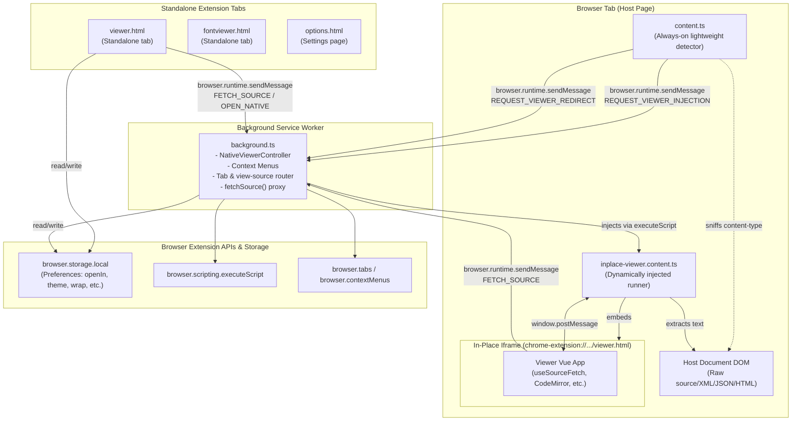
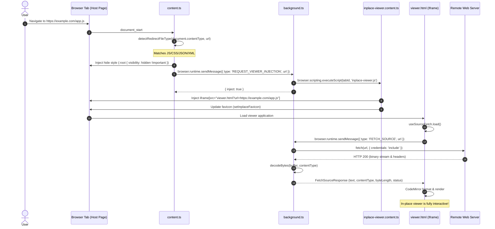
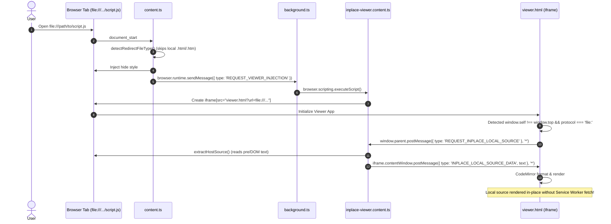
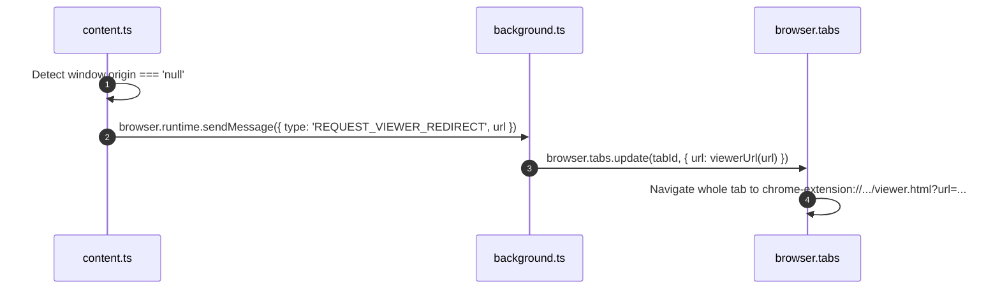
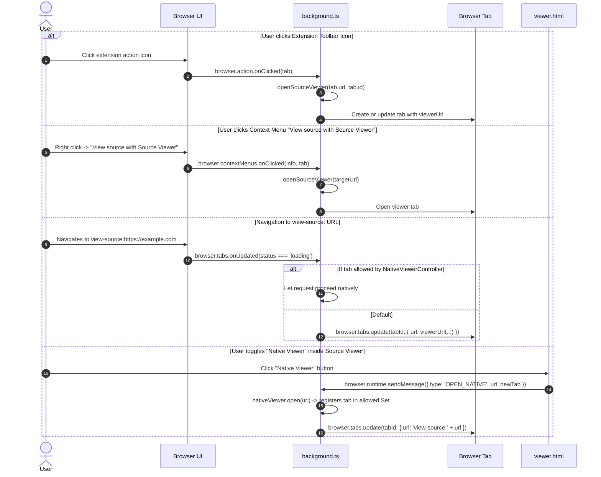
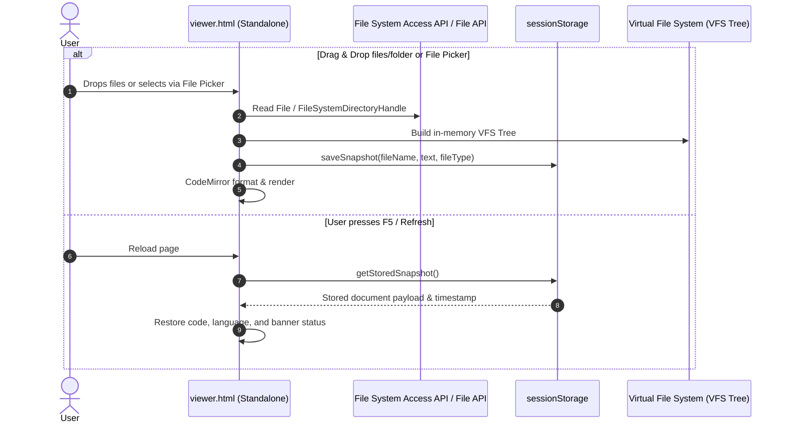

# Architecture & Cross-Context Messaging

This document defines the system architecture, execution contexts, communication channels, and messaging contracts of the Source Code Viewer Web Extension (Manifest V3).

## Table of Contents

1. [System Architecture Overview](#system-architecture-overview)
2. [Execution Contexts Matrix](#execution-contexts-matrix)
3. [Communication Transports](#communication-transports)
4. [Key Workflows & Sequence Diagrams](#key-workflows--sequence-diagrams)
   - [Workflow 1: In-Place Interception & Remote Fetching (HTTP/HTTPS)](#workflow-1-in-place-interception--remote-fetching-httphttps)
   - [Workflow 2: Local File In-Place DOM Extraction (file://)](#workflow-2-local-file-in-place-dom-extraction-file)
   - [Workflow 3: CSP Sandbox Fallback (Tab Redirection)](#workflow-3-csp-sandbox-fallback-tab-redirection)
   - [Workflow 4: Explicit Actions & View-Source Interception](#workflow-4-explicit-actions--view-source-interception)
   - [Workflow 5: Local File Picking, Dropping, & Snapshot Persistence](#workflow-5-local-file-picking-dropping--snapshot-persistence)
5. [Message Contracts Reference](#message-contracts-reference)
6. [Architectural Considerations & Constraints](#architectural-considerations--constraints)

---

## System Architecture Overview

The extension operates across multiple isolated execution contexts governed by WebExtension Manifest V3 security boundaries:

---

## Execution Contexts Matrix

| Context                        | Entry Point                                    | Lifecycle                                                                       | Privileges & Capabilities                                                                                                                               | Constraints                                                                                                 |
| :----------------------------- | :--------------------------------------------- | :------------------------------------------------------------------------------ | :------------------------------------------------------------------------------------------------------------------------------------------------------ | :---------------------------------------------------------------------------------------------------------- |
| **Background Service Worker**  | `src/entrypoints/background.ts`                | Event-driven (terminated when idle by browser in MV3)                           | Full WebExtension APIs (`browser.tabs`, `browser.scripting`, `browser.contextMenus`, `browser.storage`). Cross-origin HTTP/HTTPS fetching with cookies. | **No DOM access**. **Cannot fetch `file://` URLs** (prohibited by browser security in MV3 service workers). |
| **Lightweight Content Script** | `src/entrypoints/content.ts`                   | Runs on top-frame navigation at `document_start` (`matches: http, https, file`) | Reads `document.contentType` and URL, injects root hiding style (`:root { visibility: hidden !important; }`). Can send runtime messages to background.  | Kept minimal (no Vue, no CodeMirror) to avoid per-page overhead. Isolated world DOM access.                 |
| **In-Place Content Script**    | `src/entrypoints/inplace-viewer.content.ts`    | Injected dynamically on demand via `browser.scripting.executeScript`            | Mounts full-viewport iframe pointing to `viewer.html?url=...`, updates tab favicon, reads host DOM. Communicates with iframe via `window.postMessage`.  | Runs only when a supported source type is confirmed and page is not CSP sandboxed.                          |
| **In-Place Iframe**            | `src/entrypoints/viewer/index.html` (embedded) | Embedded in host tab inside an `<iframe>`                                       | Extension origin (`chrome-extension://...`). Full Vue 3, CodeMirror, and UI features. Can access `browser.runtime.sendMessage`.                         | Sandboxed from parent window (cannot touch parent DOM directly; must use `window.postMessage`).             |
| **Standalone Source Viewer**   | `src/entrypoints/viewer/index.html` (top tab)  | Dedicated browser tab (`chrome-extension://...`)                                | Direct window fetch of `file:///` URLs (when extension has file access toggle enabled). Full access to Web File System Access API and Drag & Drop.      | No parent page DOM to inspect.                                                                              |
| **Standalone Font Viewer**     | `src/entrypoints/fontviewer/index.html`        | Dedicated browser tab (`chrome-extension://...`)                                | Uses browser `FontFace` API and direct extension fetch (`<all_urls>` permission).                                                                       | Currently isolated from the Source Viewer.                                                                  |

---

## Communication Transports

### 1. WebExtension Runtime Messaging (`browser.runtime`)

- **API**: `browser.runtime.sendMessage(message)` and `browser.runtime.onMessage.addListener(...)`.
- **Primary Use Cases**:
  - Content scripts asking the background service worker to inject `inplace-viewer.content.ts` (`REQUEST_VIEWER_INJECTION`).
  - Content scripts requesting full tab redirection when the page is CSP-sandboxed (`REQUEST_VIEWER_REDIRECT`).
  - Viewers requesting the background script to fetch remote HTTP/HTTPS source code with origin headers and CORS bypass (`FETCH_SOURCE`).
  - Viewers delegating navigation to the browser's native `view-source:` viewer (`OPEN_NATIVE`).
- **Characteristics**:
  - Asynchronous promise-based request/response.
  - Sender metadata (`sender.tab.id`) automatically provided to the background listener.
  - Background listener returns a `Promise` resolving to the payload.

### 2. Window Messaging (`window.postMessage`)

- **API**: `window.postMessage(message, '*')` and `window.addEventListener('message', handler)`.
- **Primary Use Cases**:
  - Closing the in-place viewer from the viewer toolbar (`CLOSE_INPLACE_VIEWER`).
  - Requesting host page DOM text extraction for local files in the in-place viewer (`REQUEST_INPLACE_LOCAL_SOURCE` $\rightarrow$ `INPLACE_LOCAL_SOURCE_DATA`).
- **Why this is needed**:
  - The in-place viewer iframe runs in an extension origin (`chrome-extension://<id>`), while the host document runs in the page origin or `file://`.
  - Same-Origin Policy forbids direct DOM access across these origins (`iframe.contentWindow.document` or `window.parent.document` throws cross-origin security errors).
  - MV3 Service Workers cannot read `file://` URLs. The host page content script (`inplace-viewer.content.ts`) has direct read access to the host document DOM (`extractHostSource()`). The iframe requests this text across the window boundary via `window.parent.postMessage`.

### 3. Direct Extension Fetching

- **API**: Standard `window.fetch(url)`.
- **Usage**:
  - **Standalone `viewer.html`**: When opened as a top-level tab for a `file:///` URL and the user has granted "Allow access to file URLs", the extension origin has permission to fetch the local file directly.
  - **Standalone `fontviewer.html`**: Fetches font files directly via `<all_urls>` host permissions to pass the array buffer to `new FontFace()`.

### 4. Storage & Persistence

- **`browser.storage.local`**: Global extension preferences (theme, word wrap, font size, `openIn` preference).
- **`sessionStorage`**: In-memory tab-scoped snapshot storage for local files dropped into the viewer or selected via file picker without a persistent URL. Ensures F5 reloads preserve the active document and VFS tree.

---

## Key Workflows & Sequence Diagrams

### Workflow 1: In-Place Interception & Remote Fetching (HTTP/HTTPS)

When a user browses directly to a raw JavaScript, CSS, JSON, or XML file on the web:

---

### Workflow 2: Local File In-Place DOM Extraction (file://)

When a user navigates to a local source file (`file:///path/to/script.js`):
_Background service workers in MV3 are forbidden from fetching `file://` URLs, so the iframe delegates reading to the host content script._

---

### Workflow 3: CSP Sandbox Fallback (Tab Redirection)

When a host page delivers a Content Security Policy with `sandbox` (such as `raw.githubusercontent.com`), the host document has an opaque origin (`window.origin === 'null'`). Any embedded extension iframe would be sandboxed, disabling script execution. The extension detects this and performs a full tab redirection instead:

---

### Workflow 4: Explicit Actions & View-Source Interception

---

### Workflow 5: Local File Picking, Dropping, & Snapshot Persistence

---

## Message Contracts Reference

### Runtime Messages (`browser.runtime`)

| Message Type               | Direction                             | Payload Interface                                                                      | Response Interface                                                                                                                               | Description                                                                                                           |
| :------------------------- | :------------------------------------ | :------------------------------------------------------------------------------------- | :----------------------------------------------------------------------------------------------------------------------------------------------- | :-------------------------------------------------------------------------------------------------------------------- |
| `FETCH_SOURCE`             | Viewer $\rightarrow$ Background       | `FetchSourceRequest` `{ type: 'FETCH_SOURCE', url: string }`                        | `FetchSourceResponse` `{ ok: true, text, contentType, contentDisposition, byteLength, httpStatus, httpStatusText }` \| `{ ok: false, error }` | Fetches remote source through background to avoid CORS / host CSP restrictions. Decodes raw bytes using page charset. |
| `REQUEST_VIEWER_INJECTION` | `content.ts` $\rightarrow$ Background | `RequestViewerInjectionRequest` `{ type: 'REQUEST_VIEWER_INJECTION', url: string }` | `RequestViewerInjectionResponse` `{ inject: boolean }`                                                                                        | Requests dynamic injection of `inplace-viewer.content.ts` into the sender tab.                                        |
| `REQUEST_VIEWER_REDIRECT`  | `content.ts` $\rightarrow$ Background | `RequestViewerRedirectRequest` `{ type: 'REQUEST_VIEWER_REDIRECT', url: string }`   | `void`                                                                                                                                           | Requests full tab navigation to `viewer.html` when host page is CSP-sandboxed.                                        |
| `OPEN_NATIVE`              | Viewer $\rightarrow$ Background       | `OpenNativeRequest` `{ type: 'OPEN_NATIVE', url: string, newTab: boolean }`         | `OpenNativeResponse` `{ ok: true }` \| `{ ok: false, error }`                                                                                 | Whitelists target tab in `NativeViewerController` and opens `view-source:<url>` without interception.                 |

### Window Messages (`window.postMessage`)

| Message Type                   | Direction                          | Payload Schema                                        | Description                                                                                                                     |
| :----------------------------- | :--------------------------------- | :---------------------------------------------------- | :------------------------------------------------------------------------------------------------------------------------------ |
| `CLOSE_INPLACE_VIEWER`         | Iframe $\rightarrow$ Parent Window | `{ type: 'CLOSE_INPLACE_VIEWER' }`                    | Dispatched by toolbar close button. Prompts `inplace-viewer.content.ts` to remove iframe, restore favicon, and unhide host DOM. |
| `REQUEST_INPLACE_LOCAL_SOURCE` | Iframe $\rightarrow$ Parent Window | `{ type: 'REQUEST_INPLACE_LOCAL_SOURCE' }`            | Sent by iframe when loading a `file://` URL in-place. Requests DOM extraction from `inplace-viewer.content.ts`.                 |
| `INPLACE_LOCAL_SOURCE_DATA`    | Parent Window $\rightarrow$ Iframe | `{ type: 'INPLACE_LOCAL_SOURCE_DATA', text: string }` | Response carrying extracted host DOM string back into the viewer iframe.                                                        |

---

## Architectural Considerations & Constraints

1. **Manifest V3 Service Worker Lifecycle**:
   - The background service worker can become inactive at any time when idle.
   - All state must be stateless or reconstituted per request. The only in-memory background state is `NativeViewerController`'s transient `allowed` tab ID set, which is short-lived during direct navigation transitions.
2. **Local File Permissions (`file://`)**:
   - In Chromium and Firefox, extensions cannot access `file://` URLs unless the user explicitly checks "Allow access to file URLs" in `chrome://extensions` or `about:addons`.
   - The extension proactively verifies access via `browser.extension.isAllowedFileSchemeAccess()`. If disabled, it displays actionable instructions (`fileSchemePermissionHelp`).
3. **Double Interception Prevention**:
   - `content.ts` specifically ignores `.html` and `.htm` on `file://` so developers editing local web pages are not disrupted.
   - `nativeViewer.ts` manages a one-shot allowance set to avoid endless redirect loops between `view-source:` and `viewer.html`.
4. **Namespace Correctness**:
   - In XML documents (such as `.rss` or `.xml`), `document.createElement('style')` creates an inert element with a null namespace. All dynamically created DOM elements (`<style>`, `<iframe>`) in content scripts use `document.createElementNS('http://www.w3.org/1999/xhtml', ...)`.
